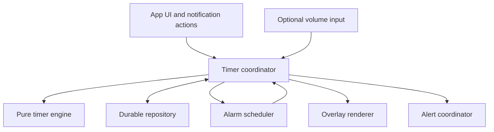
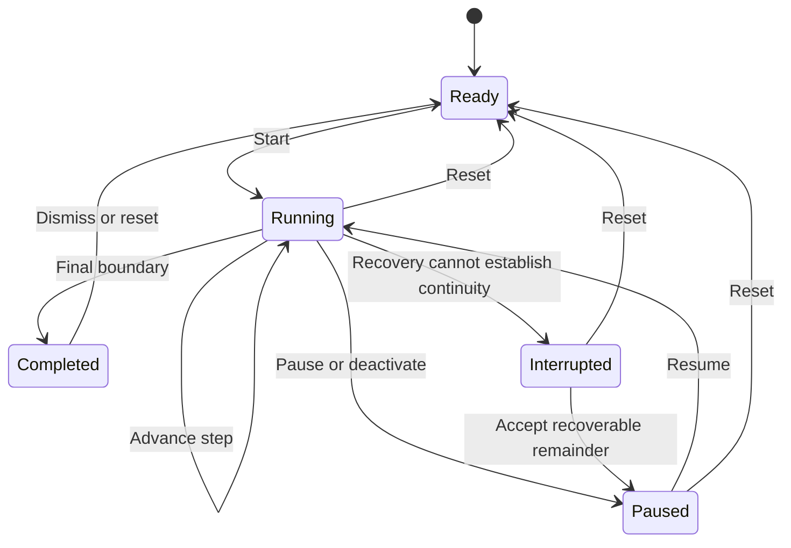

# Halo for Android — Product and Engineering Implementation Plan

**Document version:** 1.0  
**Prepared:** 8 September 2026  
**Product owner:** Aldoni  
**Status:** Implementation proposal; native platform spikes and release gates outstanding  
**Suggested repository location:** `docs/HALO_ANDROID_IMPLEMENTATION_PLAN.md`  
**Reference prototype:** [Halo interactive prototype](https://halo-edge-timer.ezral.chatgpt.site)

> Build a quiet timer that remains perceptible while someone uses their phone: up to three independent timers, adjacent colored edge-progress lines, optional translucent floating controls, and visual or haptic alerts instead of sound.
>
> This document is a build specification, not a claim that the native app already exists or that its performance has been measured. “Required” identifies an agreed product behavior. “Proposed” identifies an implementation choice or a new default that can be changed through a recorded decision. Android and Google Play constraints are called out separately.

## Contents

1. [Executive decisions](#1-executive-decisions)
2. [Product baseline and scope](#2-product-baseline-and-scope)
3. [Requirements and acceptance criteria](#3-requirements-and-acceptance-criteria)
4. [Android feasibility and release gates](#4-android-feasibility-and-release-gates)
5. [UX and interaction contract](#5-ux-and-interaction-contract)
6. [Design system and accessibility](#6-design-system-and-accessibility)
7. [Architecture and repository structure](#7-architecture-and-repository-structure)
8. [Domain model and persistence](#8-domain-model-and-persistence)
9. [Timer engine and state transitions](#9-timer-engine-and-state-transitions)
10. [Scheduling, sleep, recovery, and lifecycle](#10-scheduling-sleep-recovery-and-lifecycle)
11. [Overlay rendering and input isolation](#11-overlay-rendering-and-input-isolation)
12. [Visual alerts and haptic arbitration](#12-visual-alerts-and-haptic-arbitration)
13. [Morse vibration specification](#13-morse-vibration-specification)
14. [Volume-key control](#14-volume-key-control)
15. [Permissions and degraded operation](#15-permissions-and-degraded-operation)
16. [Security, privacy, and store readiness](#16-security-privacy-and-store-readiness)
17. [Quality targets and observability](#17-quality-targets-and-observability)
18. [Verification strategy](#18-verification-strategy)
19. [Delivery roadmap and backlog](#19-delivery-roadmap-and-backlog)
20. [CI, release, and maintenance](#20-ci-release-and-maintenance)
21. [Risk register and decision log](#21-risk-register-and-decision-log)
22. [Repository handoff and definition of done](#22-repository-handoff-and-definition-of-done)
23. [Sources](#23-sources)

## 1. Executive decisions

### 1.1 Recommended product and technical direction

| Area | Decision | Status |
|---|---|---|
| Product | Native Android timer utility; no account or server required for core operation | Proposed implementation |
| Core experience | Three independent slots, each a single timer or a named sequence | Required |
| Main interface | Renameable document-style tabs; Active/Inactive status; two MM:SS fields | Required |
| Visual style | One UI 8–inspired layout, original assets, flat numeric fields, light/dark themes | Required direction; native styling to validate |
| Overlay | Adjacent colored progress lines plus individually hideable glass controls | Required |
| Alerts | Breathe, Orbit, Ping-pong, Double pong; optional vibration and custom Morse | Required |
| Timing | Monotonic deadlines, serialized commands, persisted state, independent Android alarm integration | Proposed implementation |
| UI stack | Kotlin, Jetpack Compose, Material 3 primitives restyled for Halo | Proposed |
| Overlay graphics | Small dedicated Android custom drawing surface managed through WindowManager | Proposed; touch and geometry spike required |
| Storage | Room for timer/session state; DataStore for small app preferences | Proposed |
| Service | One owner for all active timers; foreground service for ongoing visible overlay operation | Proposed; service-type gate required |
| Global volume keys | Optional capability behind a separate platform and distribution gate | Required intent; not yet a guaranteed deliverable |
| Minimum OS | API 26 / Android 8.0 as a starting proposal | Reassess after dependency and device validation |
| Compile/target SDK | Pin the supported stable toolchain and applicable release target at repository bootstrap | Deliberately not an unverified version claim |
| Network | No runtime network dependency in the initial core release | Proposed |
| Distribution | Signed internal APK first; Play testing/release only after relevant declarations and checks | Proposed |

### 1.2 Resolve these before a full implementation commitment

1. **Overlay touch safety:** prove that three lines and floating controls do not block unrelated app touches outside their actual control bounds.
2. **Screen-off timing:** characterize short, consecutive sequence alarms in idle conditions. Exact-alarm permission does not remove every scheduling constraint.
3. **Foreground service classification:** record why the chosen type matches the behavior. `specialUse` is a candidate, not automatic approval. Current documentation also lists exact-alarm permission holders among `systemExempted` eligibility cases; evaluate the actual usage and review requirements before choosing. [S4](https://developer.android.com/develop/background-work/services/fgs/service-types)
4. **Global volume capture:** separate keys received in Halo’s own Activity from keys received while another app is active. Test the latter with the intended AccessibilityService configuration and competing services. [S6](https://developer.android.com/reference/android/accessibilityservice/AccessibilityServiceInfo)
5. **Recovery expectations:** implement the explicit reboot/interruption policy in this plan; do not silently claim continuous operation after force-stop, reboot, or permission loss.

These gates should produce small runnable experiments and evidence before polishing the complete native UI.

## 2. Product baseline and scope

### 2.1 What the prototype establishes

The conversation and prototype establish the interaction intent:

- The user continues using any ordinary foreground app; Halo is a separate overlay, not a reading application.
- Three renameable timer slots remain visible as tabs even when inactive.
- Each slot can contain one duration or an ordered list of named durations.
- Each active track has its own color, current countdown, alert style, and vibration configuration.
- Each track draws a neighboring edge line. There must be no deliberate spacing between adjacent strokes.
- Floating controls have translucent surfaces, soft shadows, a minimal integrated menu icon, and an × to hide.
- Hiding the controls must not stop timers, remove the progress lines, or disable alerts.
- Minute and second inputs are two independent fields, not four separate digits. Seconds carry/borrow across the minute boundary.
- The user can enable hold-to-adjust time control with 30-second, 1-minute, and 5-minute acceleration.
- The interface avoids long descriptive text and glossy, segmented, or mechanical-looking digital clock widgets.
- Light and dark themes apply to the complete experience.

### 2.2 What the prototype does not establish

The HTML implementation is a reference, not production architecture. It does not demonstrate:

- Real WindowManager overlays over arbitrary installed applications.
- Android lifecycle recovery, durable active sessions, or delivery through device sleep.
- Physical volume-key interception outside Halo.
- Reliable native vibration, haptic arbitration, or permission handling.
- Play approval, OEM compatibility, or measured battery behavior.
- Native accessibility, density scaling, system inset handling, or release-grade tests.

Do not wrap the prototype in a WebView and call that completion of the native requirements. Preserve its visual and behavioral decisions while replacing browser-specific machinery.

### 2.3 Initial release scope

**Core:** three tracks; single/sequence modes; current-step progress; all four visual alerts; per-track vibration and Morse; hide/restore controls; themes; persistence; permission-aware scheduling; notification recovery controls; local diagnostics; app-local volume adjustment.

**Gated extension:** global physical volume adjustment while another app is active. Keep the adapter removable without damaging the rest of the app.

**Deferred:** cloud sync, accounts, analytics SDKs, subscriptions, widgets, Wear OS, home-screen complications, community presets, arbitrary track counts, automatic foreground-app detection, screen recording, and AI functionality. Do not build these merely because the architecture could support them.

### 2.4 Bundled examples

| Preset | Step | Duration |
|---|---|---:|
| Pour-over | Blooming | 00:30 |
| Pour-over | Slow pour over | 02:00 |
| Steak | 1st sear | 01:00 |
| Steak | Flip sear | 01:00 |
| Steak | 2nd sear | 01:00 |
| Steak | Flip sear 2nd time | 01:00 |
| Steak | Sear fatty side | 00:30 |
| Steak | Rest | 05:00 |

Pour-over totals **02:30**; Steak totals **09:30**. These are editable timer examples supplied by the user, not cooking safety guidance.

## 3. Requirements and acceptance criteria

| ID | Requirement | Acceptance criterion |
|---|---|---|
| R01 | Three independent tracks | A, B, C can run simultaneously in any combination of single/sequence modes. |
| R02 | Stable identity and rename | Renaming changes labels everywhere without replacing IDs, alarms, or session history. |
| R03 | Visible tabs and activation | All tabs remain selectable. Inactivation pauses a running track and removes its overlay; activation alone does not resume it. |
| R04 | Two-field duration input | Minutes and seconds support swipe, scroll, keyboard/accessibility actions, and text entry. |
| R05 | Carry and borrow | Seconds upward: 00:59 → 01:00. Downward: 01:00 → 00:59. |
| R06 | Named sequences | Add, remove, and edit steps before a run. Start advances automatically in stored order. |
| R07 | Independent commands | Pause/reset/dismiss/adjust on one track leave the other two deadlines unchanged. |
| R08 | Launch selected/all | Launch all uses one shared start timestamp for eligible tracks. Already-running tracks are not restarted. |
| R09 | Adjacent edge lines | Three strokes share a border band with no intentional gap; geometry works at corners and after rotation. |
| R10 | Color identity | Track color is identifiable in tabs, controls, and lines; text labels provide an alternative to color. |
| R11 | Glass controls | Control can be moved; menu and × are distinct accessible actions; no decorative outline. |
| R12 | Hide and restore | Hidden track continues counting and alerting; notification provides an independent restore route. |
| R13 | Four visual alerts | Breathe, Orbit, Ping-pong, Double pong render per track without freezing other progress. |
| R14 | No sound by default | Timer and notification configuration do not intentionally emit an audible alarm. |
| R15 | Optional Morse | A–Z, 0–9, and word gaps produce the specified vibration timing. Invalid text blocks only the affected action. |
| R16 | Haptic contention | Concurrent completions do not overwrite one another’s Morse patterns without an explicit arbitration rule. |
| R17 | Volume adjustment | Tap ±30s; hold accelerates at 3s and 8s; target is explicit and frozen for the gesture. |
| R18 | Volume off | When disabled, Halo does not consume physical volume keys or apply timer changes. |
| R19 | Themes | Light/dark selected manually; optional follow-system default; no unreadable controls after a theme change. |
| R20 | Process recovery | Same-boot recreation restores accurate logical position from durable deadlines; no reset to full duration. |
| R21 | Screen-off handling | No continuous visual rendering with screen off; alert guarantees match the tested scheduling mode. |
| R22 | Permissions | Denial/revocation leads to a usable in-app mode or an explicit degraded state, not crashes. |
| R23 | Stop behavior | In-app Stop all cancels run alarms, haptics, and overlays, and stops unnecessary service work. |
| R24 | Accessibility | TalkBack, 200% text scaling, larger touch targets, reduced motion, and non-color identification are verified. |

**Definition of acceptance:** a test or recorded device observation supports each criterion. A screenshot alone does not establish timing, touch safety, or background reliability.

## 4. Android feasibility and release gates

### 4.1 Capability classification

| Capability | Assessment | Engineering consequence |
|---|---|---|
| Overlay above ordinary app windows | Supported platform mechanism | Use `TYPE_APPLICATION_OVERLAY` after explicit overlay access. |
| Above every system screen | Not promised | System UI and protected app windows can remain above or suppress Halo. |
| Touch through decorative overlay | Conditional | Non-touchable flags alone are insufficient evidence on newer Android. |
| Independent timers | Ordinary application logic | Model as three states within one engine, not three competing services. |
| Exact logical elapsed time | Achievable using monotonic deadlines | Independent of render loop and wall-clock changes. |
| Every short step alert in deep idle | Must validate | Alarm throttling can affect closely spaced wakeups. |
| Volume keys while Halo has focus | Implementable in app input handling | Test physical devices and ensure normal volume fallback. |
| Volume keys over other apps | Conditional | Dedicated accessibility/input spike and store review needed. |
| Cross-app frosted blur | Device dependent | Translucent tint is the baseline; blur is optional enhancement. |
| Custom vibration | Supported with hardware/settings limits | Check capabilities and use an explicit alert usage. |

Application overlays sit above activity windows but below critical system windows. Applications may hide overlays on sensitive screens. This is not an error that Halo should bypass. [S1, S2]

### 4.2 Spike deliverables

| Spike | Evidence to collect | Pass condition | Fallback |
|---|---|---|---|
| SP01: touch-safe border | Screen recording, touch grid results, relevant logcat | All underlying touch targets outside real Halo controls work | Redesign into perimeter windows; do not ship a touch-blocking full-screen pane |
| SP02: idle alarms | Scheduled vs actual timestamps for 30s/60s steps, three tracks | Defined precision tier is met on supported devices | Document screen-off delay; evaluate alarm-clock scheduling; keep core foreground use |
| SP03: global volume | Key down/up delivery, consumption, calls/media/accessibility conflicts | Opt-in capture with reliable release and normal-volume fallback | App-local adjustment and floating ± controls |
| SP04: glass rendering | Capability checks, blur disabled, low-power mode | Readable tinted fallback on every supported device | No cross-window blur requirement |
| SP05: service lifecycle | Start, background, permission revoke, process recreation | No illegal background start or stuck service | User-visible recovery through notification/Activity |
| SP06: current SDK | Compile/release notes, target requirement, Play declarations | Supported stable toolchain and documented current platform deltas | Narrow initial support if justified; do not evade platform restrictions |

No spike passes based solely on an emulator when the behavior involves physical keys, vibration, Samsung power management, or cross-window composition.

## 5. UX and interaction contract

### 5.1 Main menu

Top to bottom:

1. Halo identity and theme action.
2. Three document-style tabs, each showing its name and Active/Inactive state.
3. Selected track name editor and activation switch.
4. Single / Sequence segmented control.
5. MM:SS editor or sequence rows.
6. Floating-control visibility, color, glow, alert, vibration, and optional volume-control settings.
7. Launch selected, Launch all active, Preview alert, Reset selected.

No marketing paragraph, explanation of implementation, or repeated instructions. Use concise permission explanations only when the user invokes a restricted capability. Put detailed help behind a help action, not between timer controls.

### 5.2 Tab semantics

- Stable slot IDs are A/B/C internally; default names are “Timer A”, “Timer B”, “Timer C”.
- Proposed name limit: 24 user-perceived characters; trim surrounding whitespace; reject an empty final name and restore the previous name. Preserve Unicode names.
- **Selected** determines which settings are edited. **Active** means included in launch/overlay eligibility. **Running** means time is advancing. These are distinct states.
- Activating a track does not start it. Inactivating a running track first pauses it transactionally, then removes its overlay.
- Inactivation retains its definition and remaining time. Reactivation requires Resume to continue.
- All tabs may be inactive. Launch is then unavailable, and the app must not maintain an unnecessary running service.
- Rename is permitted during a run. Structural edits to a live sequence require reset or affect only a saved future definition; v1 should use reset to avoid ambiguity.
- Avoid prototype ambiguity where an inactive tab still resembles a running timer.

### 5.3 MM:SS behavior

Proposed v1 range: **00:01–99:59 per step**, matching the two-field design. Use `Long` milliseconds internally. Proposed sequence cap: 50 steps per track, validated without silently dropping rows.

| Action | Result |
|---|---|
| Increment seconds | Add one second to total duration, then derive MM and SS |
| Decrement seconds | Subtract one second, clamp at 00:01 |
| Increment minutes | Add 60 seconds, preserving second remainder |
| Decrement minutes | Subtract 60 seconds, clamp at 00:01 |
| Seconds entry of 60 | Normalize into minutes: 01:60 becomes 02:00 |
| Seconds entry of 99 | Normalize into minutes, then clamp to maximum |
| Increase at 99:59 | Stay at 99:59; no wrap to zero |
| Empty field while typing | Allow temporary editing state; validate on commit |
| Invalid paste | Reject nonnumeric content with concise field error; retain last valid value |
| Cancel editing | Restore last committed duration |

Use whole-field vertical movement. Minute/second fields must not independently wrap modulo 60, which would lose the carry. Make large fling behavior bounded and deterministic; do not allow a short accidental gesture to add an hour.

### 5.4 Sequences

- Each row has a step name, MM:SS, and remove action; the final remaining row cannot be deleted without replacing it with an editable empty row.
- Proposed step-name limit: 60 user-perceived characters.
- Preset selection replaces the editable sequence, not an active run. If edited unsaved content would be lost, use a lightweight confirmation or undo.
- Progress represents the **current step**, not the whole sequence. The control shows step index/count and name.
- At a step boundary, begin the next step immediately; a brief edge alert runs concurrently. Animation does not add time to the sequence.
- At final completion, mark Completed, emit one alert event, and wait for dismissal/reset.
- A pause freezes the current step and therefore all later step deadlines for that track.
- After an unavoidable delayed callback, determine the current step using elapsed deadlines; do not extend the entire sequence by callback lateness.

### 5.5 Floating controls

- One compact glass control per visible track; retain the requested monospace timer text here while the main MM:SS fields use clean proportional UI typography with tabular numerals.
- Body tap opens track actions; menu icon opens that track’s settings; × hides only that control.
- Drag the control body, not the menu/close action. Use touch slop and clamp to safe bounds.
- Hiding all controls leaves edge lines and alerts active. A notification action restores controls or opens Halo.
- A small restore chip may be enabled as a convenience; it is not the only recovery path and must itself be dismissible if the user wants lines only.
- Native Launch overlay should not forcibly open another app or imitate a reading page. Start the overlay and allow the user to navigate normally; finishing Halo’s Activity may reveal the prior app. Do not launch Home without a product decision.
- The notification is the reliable settings route when controls are hidden, misplaced, or suppressed.

### 5.6 Completion and dismissal

**Proposed bounded behavior:** play the selected haptic once; animate a final alert for up to 30 seconds, then retain completed state in the app and a dismissible completion notification. A quiet completed edge indicator may remain while another track keeps the overlay service active; when no track is running, remove overlay windows after the bounded alert and stop foreground work. Intermediate alerts last 2.8 seconds. These durations are defaults, not user-mandated values.

Dismiss affects only that track’s completed indication and queued haptics. It does not reset another timer, launch a new run, or reopen a hidden control. Reset returns the selected track to its configured initial state.

## 6. Design system and accessibility

### 6.1 Design tokens

Build original Halo tokens rather than copying private Samsung resources or shipping a claimed Samsung font without a license. The request is a One UI 8–inspired design direction, not Samsung affiliation.

| Token | Proposed default |
|---|---|
| Main surface | Near-black in dark mode; cool light neutral in light mode |
| Settings cards | Distinct, flat surfaces; no bevels or glossy digit gradients |
| Corner radius | 20–28dp for cards; pill radius for primary actions |
| Standard touch target | At least 48dp; expanded hit regions must not overlap |
| Main timer | Large readable MM:SS; two fields; tabular numeric alignment |
| Floating digits | Licensed/bundled monospace or system monospace fallback |
| Main labels | Approximately 14–16sp, respecting user font scale |
| Border stroke | Initial 4dp physical-density-aware width; same width for all three tracks |
| Lane spacing | 0dp between stroke edges |
| Themes | Light, dark; proposed follow-system option |
| Track identity | Three distinct default colors; changes cannot accidentally create duplicate active colors |

Android’s Compose accessibility guidance includes minimum touch target behavior. Halo must explicitly verify expanded targets inside compact overlay controls rather than assuming a small icon is accessible. [S14](https://developer.android.com/develop/ui/compose/accessibility/api-defaults)

### 6.2 Accessibility requirements

- Expose tabs as selectable controls and announce name, activation, and running status separately.
- Minutes and seconds expose increment/decrement actions and numeric range semantics.
- Do not announce the countdown every second. Announce user-initiated changes and relevant step transitions, with an option to suppress spoken alerts.
- Respect system animation reduction; provide a static or slowly pulsing alternative to moving edge patterns.
- Do not encode timer identity using color alone; notifications and controls retain names.
- Verify light/dark contrast with real overlay backgrounds, including white documents and bright video.
- Enlarge controls under accessibility settings; reflow the main screen at 200% font scaling.
- Support keyboard navigation, RTL layout, large display size, landscape, and Switch Access.
- Morse must remain optional. Never require knowledge of Morse to learn which timer completed.
- Decorative edge lines are not focusable and not traversed as dozens of accessibility nodes.

### 6.3 Blur and translucency

Cross-window blur availability can change by device and runtime state. Use capability checks and a readable tint fallback; a Compose blur applied to Halo’s own content is not automatically a blur of another app. Never request screen capture to obtain a background image. [S12](https://source.android.com/docs/core/display/window-blurs)

## 7. Architecture and repository structure

### 7.1 Dependency strategy

Use Kotlin and Compose for the app UI, coroutines/Flow for state delivery, and dependency injection with explicit interfaces. Hilt is a reasonable proposal if its build cost is acceptable. Use version catalogs, a checked-in Gradle wrapper, and pinned compatible releases selected at bootstrap. Do not use dynamic dependency versions.

Android recommends clear UI/data separation and observable state. Halo’s additional pure timer domain layer is a product-specific choice to make its critical timing logic independent from the OS. [S13](https://developer.android.com/topic/architecture/recommendations)

### 7.2 Component responsibilities

| Component | Owns | Must not own |
|---|---|---|
| MainActivity / Compose UI | Editors, permissions UI, themes, navigation | Authoritative countdown ticking |
| TimerCoordinator | Command serialization, state transitions, persistence orchestration | Rendering or app-content inspection |
| TimerEngine | Pure deadline arithmetic and event generation | Android Context, Room, notification calls |
| TimerRepository | Definitions, sessions, revisions, recovery metadata | Per-frame UI state |
| HaloRuntimeService | Foreground runtime lifecycle, engine host, platform adapter wiring | Three separate independent engines |
| AlarmScheduler | PendingIntent registration/cancellation, capability checks | UI animation scheduling |
| OverlayController | Window creation/removal, positions, insets, rendering subscriptions | Direct mutation of session state |
| AlertCoordinator | Visual alert events and one-device haptic queue | Timer duration computation |
| VolumeInputAdapter | Key/hold gesture translation to commands | Reading unrelated app content |
| NotificationController | Ongoing controls, completion summary, recovery entry | A second authoritative session store |
| RecoveryCoordinator | Reconcile durable sessions, boot/process discontinuity | Blindly resurrecting user-stopped overlays |



The coordinator is the only mutation entry point. A coroutine actor/channel or equivalent serialized command executor is sufficient; do not introduce distributed event infrastructure for three timers.

### 7.3 Suggested repository shape

```text
app/
core/model/
core/timer/                 # pure Kotlin engine and tests
core/data/                  # Room, DataStore, migrations
core/designsystem/
feature/timers/             # tabs, editors, launch controls
platform/runtime/           # service, alarms, notifications, recovery
platform/overlay/           # WindowManager and edge geometry
platform/haptics/
platform/volume/            # optional capture adapter
benchmark/
docs/adr/
docs/validation/
.github/workflows/
gradle/libs.versions.toml
```

Start with logical package boundaries if separate Gradle modules impede the initial spike. Keep the pure engine and optional volume adapter isolated from day one; split the remaining modules only where it improves build ownership or testing.

### 7.4 Core interfaces

Proposed contracts, not generated production code:

```kotlin
interface ClockSource {
    fun elapsedMs(): Long
    fun wallTimeMs(): Long
    fun bootSessionToken(): String
}

interface TimerCommandSink {
    suspend fun submit(command: TimerCommand): CommandResult
}

interface BoundaryScheduler {
    suspend fun reconcile(plan: AlarmPlan)
    suspend fun cancelAll()
}

interface OverlayHost {
    fun render(state: OverlayState)
    fun removeAll()
}
```

Use injectable fake clocks and fake platform adapters in tests. Avoid calling `System.currentTimeMillis()` directly inside domain methods.

## 8. Domain model and persistence

### 8.1 Separate definitions from runtime state

| Entity | Important fields |
|---|---|
| TimerDefinition | `timerId`, `slot`, `name`, `mode`, `singleDurationMs`, `isActive`, `definitionRevision` |
| SequenceStep | `stepId`, `timerId`, `order`, `name`, `durationMs` |
| TrackPreferences | color, visual alert, vibration enabled, Morse text, glow, control visibility preference |
| TimerSession | `sessionId`, immutable run definition snapshot, current step, run state, runtime revision |
| RuntimeCheckpoint | monotonic deadline, paused remaining, current step duration, boot token, wall-clock diagnostic anchor |
| AlertEvent | event ID, session ID, boundary ordinal, event type, delivery/expiry state |
| OverlayPosition | timer ID, display/orientation class, normalized x/y, last safe bounds |
| AppPreferences | theme, reduced-motion choice, selected track, volume-control opt-in/scope |

Store names as text, not identity. Color changes and renames do not invalidate alarm/session IDs. Snapshot the sequence at Start; edits to saved definitions cannot mutate a run behind the engine’s back.

### 8.2 Storage allocation

- **Room:** timer definitions, ordered steps, session snapshots, session revision, alert/outbox metadata. Export schemas and write migrations. [S15](https://developer.android.com/training/data-storage/room)
- **DataStore:** theme and small independent app preferences. [S16](https://developer.android.com/topic/libraries/architecture/datastore)
- Keep facts requiring one atomic transition in Room; do not divide a single “pause and deactivate” transaction across Room and DataStore.
- Persist on semantic changes: start, pause, resume, boundary, adjustment, reset, activation, and stop. Never persist every animation frame.
- Runtime remaining time is derived from a durable deadline; it is not a field decremented every second in storage.
- Normalize overlay positions relative to current safe bounds and clamp after restore.
- Proposed backup behavior: back up definitions/preferences, exclude active sessions and event queues. A restored installation must not unexpectedly resume an old timer.

### 8.3 Event delivery and crash boundaries

Commit the state transition and alert event together, then request platform effects. Use deterministic event IDs such as `(sessionId, boundaryOrdinal, alertKind)` and idempotent handling to suppress duplicates.

There is no transactional guarantee spanning Room, AlarmManager, WindowManager, and physical vibration. A crash between a committed event and an external effect can lose or duplicate an effect unless recovery policy chooses a side. Proposed policy: retry an unacknowledged final alert only if it is recent; do not replay an old sequence of intermediate Morse messages. Document and test this bounded tradeoff instead of claiming exactly-once physical delivery.

## 9. Timer engine and state transitions

### 9.1 State model

Activation and visibility are separate flags, not replacements for timer run state.



### 9.2 Invariants

1. At most three track identities exist.
2. A track has at most one active session.
3. A Running track has a valid current-step duration and monotonic deadline.
4. Paused remaining time never changes as wall time passes.
5. Renaming, hiding, and theme changes do not alter deadlines.
6. A command for one session cannot mutate another session.
7. Every sequence step has duration 1–5,999 seconds; runtime uses milliseconds.
8. Step index is always within the run snapshot.
9. A stale alarm cannot reset or complete a newer session.
10. Launch all captures one monotonic timestamp and starts only the intended eligible tracks.
11. A completed alert is not emitted from every render frame.
12. Zero active tracks implies no running track; no unneeded perpetual foreground runtime.

### 9.3 Deadline arithmetic

Use elapsed real time, which advances through deep sleep, for same-boot interval computation. Do not use uptime for a timer expected to span sleep, and do not use wall clock as the normal elapsed-time authority. [S9](https://developer.android.com/reference/android/os/SystemClock)

```text
start:
  stepDeadline = elapsedNow + remainingMs

display:
  remainingMs = max(0, stepDeadline - elapsedNow)
  displayedSeconds = ceil(remainingMs / 1000)

advance when elapsedNow >= stepDeadline:
  if another step exists:
    index += 1
    stepDeadline = previousStepDeadline + nextStepDuration
  else:
    complete
```

The previous deadline is the next step’s anchor. Using callback arrival time would accumulate drift.

### 9.4 Adjustment rules

- The input command names a timer ID, session ID if running, and target revision.
- Running/paused adjustment modifies the **current step of the current run**, not future steps or the saved preset.
- Ready adjustment changes the single duration or selected sequence row; the editor must clearly indicate the selected row. This is a refinement over the prototype’s implicit first-row targeting.
- Clamp remaining time to 1–5,999 seconds. Reducing below zero does not silently skip a step; a future explicit Skip action would be a separate feature.
- Preserve elapsed time within the current step when adjusting the progress denominator: `newStepDuration = elapsedWithinStep + newRemaining`.
- For a running track, reschedule its boundary after the durable adjustment transaction. The renderer receives the new denominator and deadline from one state revision.
- Preserve millisecond remainder for a running timer; avoid adding almost a second on each adjustment due to display rounding.

### 9.5 Concurrency ordering

All commands pass through the same executor. At a command’s timestamp, first reconcile any already-due boundaries, then apply the command to the resulting state. Document this for “Pause at exactly zero” and “+30 seconds at the boundary.”

Use an alarm generation/revision in callbacks. Outdated callbacks perform no state mutation except a safe reconciliation request. Do not use UI-selected track as the target of an already-issued notification action or volume hold.

## 10. Scheduling, sleep, recovery, and lifecycle

### 10.1 Three different clocks of work

| Work | Mechanism | Important distinction |
|---|---|---|
| Visible animation | Frame scheduler / Choreographer | Cosmetic; never the timer authority |
| In-process boundary detection | Coroutine scheduling plus deadline reconciliation | Fast while alive, not a wake guarantee |
| Durable wake/expiry delivery | AlarmManager adapter | Subject to platform permissions and mode constraints |

Do not use WorkManager, a repeating one-second alarm, or a JavaScript-style interval as the deadline mechanism.

### 10.2 Foreground runtime

Start from an explicit visible user action when launching overlays. Promote the service promptly with its ongoing notification. One service hosts all three sessions and their overlays. Android requires appropriate foreground-service type declarations on applicable targets; use the chosen type consistently in manifest and runtime calls. [S4](https://developer.android.com/develop/background-work/services/fgs/service-types)

Do not assume overlay permission alone permits every background restart. For apps targeting Android 15+, the overlay-related background-start exemption requires an actually visible overlay, unless another exemption applies. [S5](https://developer.android.com/about/versions/15/behavior-changes-15)

Stop or suspend unnecessary foreground work when there are no running sessions and no bounded completion animation to show. Long-lived paused sessions belong in durable storage, not in a busy loop.

### 10.3 Alarm strategy: required decision

**Proposed baseline:** one next-boundary alarm per running track, plus in-process scheduling. Reconcile all tracks whenever any boundary wakes the process. Do not queue one OS alarm per second or pre-register thousands of sequence steps.

- Exact-alarm access strategy must be explicit. Evaluate `USE_EXACT_ALARM` eligibility for a timer app versus user-granted `SCHEDULE_EXACT_ALARM`; choose one justified release strategy and recheck policy before submission.
- Check capability before scheduling and handle revocation. Permission loss can cancel future alarms and stop the app; recovery must reconcile durable sessions. [S3](https://developer.android.com/develop/background-work/services/alarms)
- `setExactAndAllowWhileIdle` is not an unlimited stream of exact 30-second wakeups. The API documents dispatch-frequency limits, including substantially longer intervals in idle. [S10](https://developer.android.com/reference/android/app/AlarmManager)
- Evaluate `setAlarmClock` only for genuine user-visible timer alarm semantics, with its system visibility/resource implications. Do not use it as a hidden throttling workaround. [S3](https://developer.android.com/develop/background-work/services/alarms)
- Until SP02 passes, label screen-off short-step alert precision as conditional. Logical sequence position can recover correctly even when one or more alerts were late.
- Do not hold a permanent CPU wake lock to hide scheduling deficiencies. Any short wake lock around delivery must have a strict timeout and measured justification.

**Release gate:** choose and document which supported operating conditions meet the precision target; shipping claims must match that evidence.

### 10.4 Alarm identity and effects

PendingIntents must be explicit and immutable where appropriate. Use distinct identity for each track/session or a well-defined shared reconciliation alarm. Extras alone are not a unique PendingIntent identity. Persist enough metadata to cancel old schedules and reject stale callbacks.

On delivery: load state → verify boot/session/revision → reconcile deadlines → commit state/events → schedule next boundary → emit eligible alerts. Keep receiver work bounded; use the legal runtime continuation path for longer work.

### 10.5 Recovery policy

| Event | Proposed behavior |
|---|---|
| Rotation / Activity recreation | UI reconnects; service/session deadline unchanged |
| Same-boot process death | Reconstruct from durable monotonic deadline and snapshot |
| Late wake across several steps | Advance to correct current step; summarize missed changes; do not replay every intermediate haptic |
| Wall-clock or timezone change | No change to same-boot monotonic countdown |
| Device reboot | Mark prior Running sessions Interrupted; keep definitions; do not silently resume from stale elapsed values |
| App update | Migrate state; resume same-boot valid sessions only after continuity checks |
| Overlay access revoked | Remove windows immediately; timers continue only through permitted runtime/notification paths |
| Exact-alarm access revoked | Mark scheduling degraded; reconcile when user returns; no false “precise background alerts” status |
| In-app Stop all | Cancel alarms and haptics, remove overlays, end runtime |
| Force-stop | No promised recovery until the user reopens Halo |
| Task Manager Stop | Treat separately from ordinary process death; check user-requested exit information before restoring overlays |
| Backup restored to another device | Restore definitions/preferences only; discard live runtime checkpoints |

Android’s foreground-service Task Manager stop does not provide a callback and can leave scheduled alarms in place. Do not equate it with Settings force-stop. Re-entry must respect user-requested stopping rather than automatically resurrecting overlays. [S11](https://developer.android.com/develop/background-work/services/fgs/handle-user-stopping)

### 10.6 Notification behavior

- Ongoing channel: silent status and actions for Open, Pause/Resume, Show controls, Stop all; prioritize the most important actions if platform space is limited.
- Completion channel: silent notification; haptics are managed intentionally to avoid duplicate notification-plus-custom vibrations.
- Show at least timer names, current step where space permits, and remaining/completed state.
- Do not refresh a notification at display frame rate. Use chronometer facilities where applicable and bounded updates for multi-track state.
- On Android 13+, denial of notification permission affects drawer visibility of foreground-service notices. A user may still see the service in Task Manager. Hidden controls therefore need an in-app recovery route even if notification restoration is unavailable. [S8](https://developer.android.com/develop/ui/compose/notifications/notification-permission)
- Default lock-screen content should omit custom names/Morse text if the user chooses private notifications; expose a generic timer status.

## 11. Overlay rendering and input isolation

### 11.1 Window plan

**Preferred initial spike:** one decorative full-display edge window for all tracks, marked non-focusable and non-touchable, plus small bounded windows for interactive controls.

This avoids three overlapping full-display windows and lets all lines share one geometry calculation. However, Android’s untrusted-touch rules must be satisfied: visual transparency at a pixel is not sufficient evidence that the window is safe. The documented combined-opacity threshold is relevant to application-overlay touch pass-through. [S7](https://developer.android.com/about/versions/12/behavior-changes-all)

- Query the supported maximum obscuring opacity where the API permits; do not hardcode a device override.
- Evaluate window-level alpha and any overlapping same-app windows together.
- One decorative window avoids compounded opacity from three separate border windows.
- Control windows may intercept touches only in their small declared bounds.
- Test blank areas inside/around rounded controls; an oversized transparent layout is still an input hazard.
- Never disable platform touch-security settings through ADB, root, or a user setup instruction.

If a full-display non-touchable window fails, redesign as narrow perimeter windows. That alternative must address seams, corner geometry, multiple-window opacity, and screen-edge gestures. Do not merely increase transparency until screenshots look acceptable.

### 11.2 Adjacent-lane geometry

For equal stroke width `w = 4dp` and no gap, centerlines are separated by exactly `w`:

```text
centerInset(i) = safeOuterInset + w/2 + i*w
innerRadius(i) = max(0, outerRadius - centerInset(i))
```

Use concentric rounded paths built from actual window bounds. Do not scale a fixed portrait SVG to arbitrary aspect ratios; that distorts stroke widths and corners.

- All visible/participating lanes are packed in stable A/B/C order.
- When a track is deactivated, compact remaining lanes so no unused interior gap remains.
- Hide control ≠ deactivate lane.
- When only some tracks are running, proposed behavior is to pack only running/completed-visible lanes. Idle tabs do not reserve a blank line. This intentionally improves the prototype’s possible blank reserved lane.
- Use path-length-based progress, starting at the top center and proceeding clockwise.
- Minimize antialiasing seams where strokes meet; inspect pixel-level screenshots at supported densities.
- Glow must not become an opaque wash that makes adjacent colors indistinguishable. Limit blur/spread while preserving thicker cores.

### 11.3 Insets and screen shapes

Observe orientation, display size, navigation mode, cutouts, rounded corners where reported, keyboard insets, and fold/unfold changes. Recompute paths only when geometry changes, not every frame.

Default to the usable overlay area permitted by the OS. Do not promise drawing above the keyboard or status bar. Decide per device whether the edge should remain behind an IME or move to the available area; prevent control overlap with typing. [S1](https://developer.android.com/reference/android/view/WindowManager.LayoutParams)

Initial release targets the primary display. DeX/external-display support requires a separate geometry/input validation pass; do not mirror controls onto a second display accidentally.

### 11.4 Rendering lifecycle

- Progress interpolation reads a snapshot and the current monotonic clock.
- UI text can update once per displayed second; smooth line movement can use a bounded frame cadence.
- Cache paths and paints; avoid allocations per frame.
- Stop animation when screen off, display removed, overlay revoked, or service ended.
- Resume by reconciling time, not by continuing a paused visual animation offset.
- Reduced-motion mode uses lower-motion alerts and avoids unnecessary high-rate redraws.
- MainActivity and overlay theme update from shared preferences without restarting timers.

## 12. Visual alerts and haptic arbitration

### 12.1 Visual behavior

| Mode | Required interpretation | Proposed cadence |
|---|---|---|
| Breathe | Whole track’s border fades in/out | 3.2s cycle |
| Orbit | One luminous segment circles the track | 2.8s per circuit |
| Ping-pong | One segment reverses direction along the perimeter | 3.6s outbound, then reverse |
| Double pong | Two segments separated by half a perimeter, moving/reversing together | 2.8s outbound, then reverse |

Double pong is an alert style within one track; it is not the same feature as two parallel timers.

Normal progress for other tracks must remain visible during an alert. At an intermediate boundary, refill that track to the new step while its short alert plays, then return to current progress. On final completion, preserve an explicit completed state independently of animation duration.

### 12.2 One device, one haptic output

Proposed arbitration policy:

1. Generate an event immediately when the engine crosses a boundary.
2. Present visual indications immediately for all affected tracks.
3. Queue haptic patterns serially, ordered by scheduled boundary time; ties use stable A/B/C order.
4. Final completions outrank stale intermediate-step events when the queue is congested.
5. Intermediate haptics older than 5 seconds are dropped; record the skip in local diagnostics.
6. Bound total queued playback to 30 seconds. Coalesce overflow into one brief generic completion cue rather than creating an endless queue.
7. Preview requests are lowest priority and are canceled by real completion events.
8. Dismiss/reset removes that track’s pending events. Stop all cancels the active vibrator and all queued events.
9. Canceling one track must not discard queued events for another track; restart the queue safely if cancellation interrupts shared hardware output.

This resolves a weakness of directly calling vibration once per track: a later call can replace the pattern already playing.

Use appropriate vibration usage attributes so Android can apply the user’s settings. Account for absent vibrator/amplitude control and background usage requirements. Never raise device volume or silently override Do Not Disturb. [S17, S18]

## 13. Morse vibration specification

### 13.1 Text and encoding

- Optional per-track setting: Off, Double tap, or Morse text.
- Proposed maximum: 24 characters including spaces; uppercase internally; accept A–Z and 0–9.
- Collapse consecutive spaces and trim ends. Reject punctuation/non-Latin characters with an explicit validation message; do not silently transliterate a name.
- Empty/invalid Morse text blocks starting only that track when Morse vibration is selected and enabled. Visual-only use remains possible by disabling vibration.
- Display encoded dots/dashes and a Test vibration action.
- Runtime announcements use the track’s configured text. Automatically converting every sequence step name to Morse is not part of v1.

### 13.2 Timing

| Element | Units | Initial timing |
|---|---:|---:|
| Dot | 1 | 100ms on |
| Dash | 3 | 300ms on |
| Gap between elements within a character | 1 | 100ms off |
| Gap between characters | 3 | 300ms off |
| Gap between words | 7 | 700ms off |

The spacing gap is the total gap at that boundary, not an extra gap added on top of another separator.

Examples:

- `C` → `-.-.`
- `FLIP` → `..-. .-.. .. .--.`
- `SOS` → `... --- ...`
- `E T` → 100ms on, 700ms off, 300ms on.

### 13.3 Native waveform conversion

Keep encoder output as explicit segments `{on: Boolean, durationMs: Long}`. Convert to the Android waveform API at the adapter boundary. This avoids a browser-to-native bug: the browser vibration array begins with vibration, while the Android timings-only waveform convention begins with an off interval. Alternatively use explicit amplitudes with each duration. Test the exact native output array. [S19](https://developer.android.com/reference/kotlin/android/os/VibrationEffect)

No infinite repeating Morse by default. Validate total encoded duration before playback. Proposed pattern limit: 20 seconds per event; show the calculated duration and reject overlong text at the chosen speed rather than silently truncating it. Twenty-four long Morse characters can exceed that cap.

Physical haptic duration/strength varies by motor and settings. A successful API call is not proof the user felt every element. Test readability with short words on the Samsung reference device and one other hardware family.

## 14. Volume-key control

### 14.1 Product contract

The custom control is **off by default** and has an explicit toggle. It adjusts the selected/armed timer, not the loudness of an alarm.

| Gesture elapsed time | Step per adjustment |
|---|---:|
| Initial press | ±30s |
| Hold under 3s | ±30s |
| Hold from 3s to under 8s | ±60s |
| Hold at least 8s | ±300s |

Proposed repeat interval: 600ms. Use elapsed hold time, not platform key repeat count, to choose acceleration. Fire one initial adjustment on down; start the repeat loop separately.

### 14.2 Scope distinction

**App-local:** when Halo’s Activity is focused, handle volume key events through its normal key dispatch. Verify that disabled control leaves normal volume behavior unchanged.

**Global:** a non-focusable ordinary overlay is not a general key interceptor. A candidate implementation uses a user-enabled AccessibilityService requesting key filtering. The API exposes this capability, but delivery and consumption must be tested with other services and OEM behavior; do not claim universal availability. [S6](https://developer.android.com/reference/android/accessibilityservice/AccessibilityServiceInfo)

Apps that are not genuinely accessibility tools have disclosure/consent and declaration requirements for AccessibilityService use. Halo must describe its actual function accurately and must not declare itself an accessibility tool simply to avoid obligations. Store acceptance is not guaranteed by the existence of the API. [S20](https://support.google.com/googleplay/android-developer/answer/10964491?hl=en)

### 14.3 Input safety and arming

Proposed global mode requires both the user’s opt-in and a valid current target. Show a compact armed indicator with the timer name when keys are redirected.

- Freeze `timerId` and `sessionId` on key down. Switching tabs mid-hold cancels the hold before changing target.
- Key up, canceled event, service disconnect, toggle off, target inactive, device lock, and loss of the required operating context all stop the repeat job.
- Consume matching down/up pairs consistently. Pass unrelated keys through immediately.
- Do not consume both keys as an accessibility shortcut chord; cancel adjustment and yield the chord according to the validated platform behavior.
- If direction reverses, cancel the previous hold and start a new acceleration timeline.
- A missing release must not create unlimited repeated adjustment. Add a bounded maximum hold duration, proposed 15 seconds, requiring release before further repetition.
- If another accessibility tool needs the keys, fail safely and leave normal behavior; do not ask the user to disable essential accessibility tools.
- While a call or media-volume interaction cannot be reliably distinguished without additional permissions, keep global mode explicitly armed and easy to turn off. Do not request phone/microphone access merely for this convenience.
- When controls are hidden, notification actions allow disarming and choosing another target.

### 14.4 Boundary and session policy

A hold begins against a particular run/step revision. Proposed behavior: cancel the hold when that step finishes; do not accidentally add five minutes to the next step. A deliberate new press can then adjust the new step.

On a completed track, a new press may prepare a new duration only through a clearly defined Ready transition. Do not silently restart a completed timer from a stale physical key repeat.

### 14.5 Release fallback

If global capture fails SP03 or distribution review, ship working app-local volume adjustment and explicit floating ± controls. Keep the global feature marked unavailable; do not fake success. This is a contingency, not permission to omit the requested investigation.

## 15. Permissions and degraded operation

| Capability | Permission/access | Request moment | Denial/revocation behavior |
|---|---|---|---|
| Cross-app edge/control windows | `SYSTEM_ALERT_WINDOW` special access | First Launch overlay | In-app timers remain usable; no windows added |
| Ongoing runtime | `FOREGROUND_SERVICE` plus justified type permission | Manifest/runtime setup | Clear launch failure and no half-started state |
| Notifications | `POST_NOTIFICATIONS` on applicable versions | Before relying on background recovery/completion notices | Explain lost notification recovery; retain app launcher route |
| Precise scheduling | Selected exact-alarm strategy | Before promising off-screen precision | Degraded scheduling status; no silent guarantee |
| Haptics | `VIBRATE` | Manifest | Visual alerts remain available if hardware/settings suppress vibration |
| Global keys | User-enabled accessibility service, if approved | Only when enabling global key mode | App-local keys and UI controls remain |
| Boot reconciliation | `RECEIVE_BOOT_COMPLETED`, if retained | Manifest | No auto-start overlay; mark interrupted sessions for next open |
| Short delivery CPU work | `WAKE_LOCK`, only if spike demonstrates need | Manifest plus bounded runtime acquisition | No perpetual lock; timeout and cleanup |

Do not request storage, camera, microphone, contacts, notification-listener, usage-access, location, or broad package visibility for the defined core app. The overlay does not need to understand what the other app is displaying.

### 15.1 Permission flow rules

- Ask in context, one capability at a time, with a concise reason and a path back.
- Recheck permission after returning from system settings; do not infer approval from navigation.
- Catch WindowManager/service/alarm exceptions at their boundaries and reconcile state.
- Revocation must not leave stale “running reliably in background” messaging.
- Required disclosure text is an exception to the “minimal descriptions” aesthetic; place it only in the relevant permission flow.

## 16. Security, privacy, and store readiness

### 16.1 Privacy posture

Proposed initial build operates offline and omits `INTERNET` unless a later approved capability requires it. No analytics SDK, ad SDK, cloud identity, or remote configuration is needed for the current scope.

Timer names and Morse text may contain personal information. Do not include them in crash logs, telemetry, notification lock-screen previews by default, or shared diagnostic files without explicit selection.

### 16.2 Android component boundaries

- Internal runtime service and action receivers are non-exported unless a documented platform entry point requires otherwise.
- Accessibility service, if included, is protected with the platform binding permission and minimal metadata.
- Do not enable window-content retrieval, screenshots, gesture execution, or broad accessibility event collection for a key-only feature.
- Validate all Intent extras: IDs, action enum, durations, and revisions. A malformed action must be harmless.
- Use explicit, immutable PendingIntents for fixed actions; document any required mutability.
- Do not store signing keys, API credentials, or repository credentials in source.
- Do not load remote executable code or use reflection to access hidden APIs.
- Add a clear Stop all action independent of the overlay display.

### 16.3 Store checklist

Before submission, record:

- Actual service type and rationale; associated Play declaration where required.
- Exact-alarm strategy and eligibility rationale.
- Accessibility declaration, in-app consent, and demonstration video if global keys use that API.
- Accurate Data safety answers based on the packaged build and dependencies.
- Privacy policy covering local storage, optional diagnostics, and any accessibility use.
- Screenshots of real native behavior, including its permission requirements; do not advertise overlay behavior above protected screens.
- Current target SDK and release requirements verified again at submission.

A sideloaded/internal build can validate technical behavior, but successful sideloading does not establish Play eligibility.

## 17. Quality targets and observability

These are **proposed acceptance targets**, not measured results. Capture actual baselines before committing to public claims.

| Area | Proposed target / gate |
|---|---|
| Engine arithmetic | Exact deterministic results under fake-clock tests; no cumulative callback drift |
| Foreground step dispatch | p95 within 250ms of deadline on reference devices; report p99 and max |
| Screen-off alert dispatch | Separate measured SLO after SP02; no universal precision claim beforehand |
| Input response | Visible adjustment feedback within 100ms p95 under normal load |
| Rendering | 30fps sufficient for normal border motion; higher cadence only if profiling justifies it |
| Frame work | Target ≤4ms p95 custom drawing work on reference hardware; investigate sustained missed frames |
| Idle | No periodic per-frame work when no visible animation or screen is off |
| Battery | Paired baseline/overlay tests at fixed brightness and workload; proposed incremental budget ≤2 percentage points/hour, recalibrated from evidence |
| Memory | Stable after 100 launch/hide/theme/rotate cycles; no monotonic window or bitmap leak |
| Stability | Zero release-blocking crashes, ANRs, or untrusted-touch failures in the acceptance matrix |
| Binary size | Track compressed artifact size each release; no arbitrary large asset/font dependency without justification |

### 17.1 Local diagnostics

Maintain a bounded ring buffer of structured events: event type, timer/session pseudonymous IDs, elapsed timestamps, scheduling mode, callback lateness, permission state, service transition, queue drop reason, and device/API identifiers.

Never log full key streams or other app content. Log only recognized adjustment actions and timing if diagnostics are enabled. Provide an explicit export with redaction preview; no automatic upload in v1.

Useful measurements: `boundary_lateness_ms`, `alarm_revision_rejected`, `overlay_attach_failed`, `haptic_queue_wait_ms`, `haptic_dropped`, `input_hold_canceled`, and `recovery_reason`. A metric name is not a reason to introduce a server.

## 18. Verification strategy

### 18.1 Pure engine and property tests

- All single/sequence mode combinations across three slots.
- Equal and staggered starts; Launch all shared timestamp.
- Pause/resume at 1ms before/at/after a boundary.
- Delayed callbacks crossing multiple steps.
- Rapid ± adjustments while another track completes.
- Hide/show, rename, theme, selected-tab changes preserve every deadline.
- Reset/stop invalidate stale alarms and event revisions.
- No sequence index overflow, negative remaining time, or overflow from maximum step counts.
- Different wall-clock offsets leave same-boot results unchanged.
- Random command traces compared against a simple reference model.
- Serialization/reload and database migrations retain identity and invariants.

### 18.2 Required duration examples

| Initial value | Operation | Expected |
|---|---|---|
| 00:59 | Seconds +1 | 01:00 |
| 01:00 | Seconds −1 | 00:59 |
| 01:59 | Minutes +1 | 02:59 |
| 00:01 | Seconds −1 | 00:01 |
| 99:59 | Seconds +1 | 99:59 |
| 01:00 | Enter seconds 60 | 02:00 |
| 01:00 | Volume +30s | 01:30 |
| 01:00 | Hold threshold 3,000ms | Subsequent adjustment is +60s |
| 01:00 | Hold threshold 8,000ms | Subsequent adjustment is +300s |
| Running A and B | Adjust A | B’s deadline unchanged |

### 18.3 Haptic tests

- Verify the complete A–Z/0–9 table against a reference fixture.
- Dot/dash and element/character/word gaps; multiple spaces; lowercase input.
- Empty, unsupported, maximum length, and over-duration text.
- Native leading-off waveform convention or explicit amplitude mapping.
- Simultaneous A/B/C completions; stale intermediate events; preview preemption.
- Stop all, dismiss one, absent vibrator, DND and vibration disabled.
- Physical device evaluation of short Morse words; emulator tests are insufficient.

### 18.4 UI and overlay tests

- Screenshots in light/dark, with white and dark host apps.
- 200% font scale; narrow screen; landscape; RTL; keyboard open.
- MM and SS whole-field scrolling with carry/borrow.
- Rename tabs while running; long Unicode names; empty-name cancel.
- Hide all controls and restore without restarting any timer.
- Tap targets under all non-control areas of the overlay, including corners and transparent regions.
- Drag control to every edge; rotate; hide/reopen; resize keyboard.
- Protected-window suppression; return to ordinary app.
- Three adjacent strokes at supported densities; no clipping, deliberate gap, or corner collision.
- Theme switching preserves runs and keeps glass controls legible.

### 18.5 Lifecycle/device matrix

| Dimension | Minimum coverage |
|---|---|
| Primary hardware | Samsung S24 with the owner’s actual OS/One UI build recorded |
| Additional OEM | Pixel or comparable reference Android device |
| Lower performance | One midrange device with 60Hz display |
| API coverage | Minimum supported, 31, 33, 34, 35, 36, and current release/preview relevant at build time |
| Power states | Normal, battery saver, screen off, forced Doze, restricted background setting |
| Lifecycle | Process kill, Activity recreation, task removal, Task Manager stop, Settings force-stop, reboot, update |
| Permission states | Every permission granted, denied, revoked during run, restored |
| Input | Software keyboard, physical volume keys, Bluetooth keyboard if claimed |
| Accessibility | TalkBack, Switch Access, another key-filtering service where available |
| Display | Gesture/three-button navigation, cutout, rotation; foldable/DeX only if claimed |

Record OS build fingerprints and app versions in device reports. A report reading “tested on Samsung” is insufficient.

### 18.6 Release-blocking conditions

- Underlying applications cannot be touched normally because of Halo.
- One track’s reset/pause changes another track’s time.
- Background timing is advertised as precise without supporting idle tests.
- Global key mode consumes keys while off, stuck, or lacking a target.
- All controls can disappear with no usable restoration path.
- Morse or notification vibrations loop indefinitely after Stop all.
- Service starts violate current platform restrictions.
- Process recovery replays stale completed sessions as new timers.

## 19. Delivery roadmap and backlog

Do not commit to a calendar estimate before the platform spikes. Use the following sequence and exit criteria. Assign actual owners when the repository/team exists.

### Phase 0 — Repository and feasibility

**Deliverables:** buildable shell; supported toolchain record; SP01–SP06 evidence; initial ADRs; signed internal spike APK.

**Exit:** core overlay interaction is feasible, scheduling tiers are understood, and global volume scope is explicit.

### Phase 1 — Deterministic timer core

**Deliverables:** domain model, command executor, fake-clock tests, Room persistence, three independent sessions, sequence progression, carry/borrow and adjustment rules.

**Exit:** arithmetic, isolation, stale-event, and recovery tests pass without real Android rendering.

### Phase 2 — Native settings UI

**Deliverables:** tabs, rename/activation, MM:SS fields, sequences/presets, themes, accessibility semantics, inline validation.

**Exit:** owner approves native UI direction; no old four-digit/glossy widget; all core actions work in-app.

### Phase 3 — Overlay/runtime integration

**Deliverables:** three adjacent lanes, draggable glass controls, hide/restore, notification controls, foreground runtime, alarm adapter, permission flows.

**Exit:** real-app touch safety and lifecycle matrix pass on primary Samsung and additional OEM.

### Phase 4 — Alerts and volume controls

**Deliverables:** four visual modes, haptic queue, Morse encoder, preview, app-local keys, gated global adapter.

**Exit:** concurrency and key-release safety pass; global capture is either validated or explicitly unavailable with working fallback.

### Phase 5 — Hardening and internal release

**Deliverables:** profiling, migration tests, recovery reports, signed release candidate, privacy/store artifacts, release notes and known limitations.

**Exit:** no release-blocking findings; acceptance report maps R01–R24 to evidence.

### Phase 6 — Distribution

**Deliverables:** internal testing track or direct private release; gradual rollout plan; crash/ANR review; support path.

**Exit:** product claims, permissions, distribution declarations, and actual capability match.

### 19.1 Initial issue backlog

| Issue | Work item | Depends on | Exit evidence |
|---|---|---|---|
| H-001 | Bootstrap native repo and pinned build toolchain | None | Reproducible debug build |
| H-002 | Overlay/touch/opacity spike | H-001 | SP01 report |
| H-003 | Screen-off scheduling spike | H-001 | SP02 timing table |
| H-004 | Global volume capture spike | H-001 | SP03 report and fallback decision |
| H-005 | Service type and permission ADR | H-002, H-003 | Signed-off engineering decision |
| H-010 | Timer model and command engine | H-001 | Domain tests |
| H-011 | Sequence deadlines and missed-boundary reconciliation | H-010 | Fake-clock cases |
| H-012 | Room schema, sessions, revisions, migrations | H-010 | Recovery/migration tests |
| H-013 | Alarm scheduler with stale-event protection | H-003, H-011, H-012 | Device/adapter tests |
| H-020 | Three renameable tabs and activation | H-010 | UI tests |
| H-021 | MM:SS whole-field controls | H-020 | Carry/borrow and accessibility tests |
| H-022 | Sequence rows and supplied presets | H-021 | Preset totals and validation |
| H-023 | Light/dark original Halo design system | H-020 | Reviewed native screenshots |
| H-030 | Shared three-lane renderer | H-002 | Geometry and touch evidence |
| H-031 | Glass controls, drag, hide/restore | H-030 | Recovery and hit-target tests |
| H-032 | Service and notification actions | H-005, H-013 | Lifecycle matrix |
| H-040 | Visual alert modes | H-030 | Concurrent alert tests |
| H-041 | Morse and one-device haptic queue | H-010 | Encoder and hardware tests |
| H-042 | Hold acceleration and app-local keys | H-021 | Gesture timing tests |
| H-043 | Optional global key adapter | H-004, H-042 | Permission/review/device gates |
| H-050 | Performance and battery qualification | H-030–H-043 | Paired benchmark report |
| H-051 | Security/privacy and distribution review | H-032, H-043 | Release checklist |
| H-052 | Release candidate and owner acceptance | All core work | R01–R24 traceability |

## 20. CI, release, and maintenance

### 20.1 Pull-request checks

- Compile relevant variants; unit tests; Android lint; Kotlin formatting/static analysis.
- Pure timer property tests and migration tests.
- Secret scanning and dependency review.
- Deterministic screenshot tests for a small stable set of main UI states.
- Emulator integration tests for service/notification flows where feasible.
- Manual device gate for changes affecting overlays, haptics, scheduling, or hardware keys.

Avoid a screenshot snapshot for every possible second value. Tests should cover contracts, boundaries, and previously observed regressions.

### 20.2 Branch and review policy

- Protected main branch; short feature branches; reviewed PRs with a focused reason and validation evidence.
- Record behavior changes affecting timings/permissions in an ADR or changelog.
- No release from a dirty worktree; record commit SHA, version name/code, build toolchain, and artifact hash.
- Keep optional accessibility implementation separable, potentially in a product flavor if distribution needs differ. Different flavors must have honest capability descriptions.

### 20.3 Signing and artifacts

- Debug keys never sign production releases.
- Store release signing material in the chosen secure CI/developer credential store.
- Decide application ID and ownership before the first production release; do not invent a permanent package namespace from the prototype URL.
- Produce APK for internal device testing and AAB if distributing through Play.
- Archive mapping files, native symbols where applicable, test reports, migration schemas, and release notes.
- Define rollback as a forward fix or eligible older code built with a higher version code; database compatibility must be considered before downgrading code.

### 20.4 Maintenance triggers

Re-run relevant platform gates when target SDK changes, Samsung/Android updates alter overlay or scheduling behavior, Play policy changes, or a new OEM/device family is advertised as supported. Review dependency updates regularly; do not auto-merge changes to timer/scheduling code solely because compilation passes.

## 21. Risk register and decision log

| Risk | Severity | Mitigation / decision |
|---|---|---|
| Touch blocking by full-screen overlay | Critical | SP01 and release blocker; perimeter-window fallback |
| Short sequence alerts delayed during idle | High | SP02, precise claims tied to tested conditions, scheduling ADR |
| Global volume unavailable or rejected | High | Isolated optional adapter, app-local/floating fallback, honest distribution scope |
| Process/system termination | High | Durable deadlines, explicit interrupted/recovery behavior |
| Haptic patterns overwrite each other | High | Serialized alert queue and bounded stale-event policy |
| Hidden controls cannot be recovered | High | Notification and app-launcher recovery independent of overlay |
| Dynamic blur unsupported | Medium | Tinted fallback; no screen capture |
| Colors illegible in light mode | Medium | Contrast checks, names, accessible palette |
| Hold repeats continue after release loss | High | Cancel paths, fixed target, maximum hold, physical tests |
| Current code/prototype assumptions leak into Android | High | Pure engine, no WebView substitution, contract-based tests |
| Overengineering delays a small utility | Medium | Logical boundaries first; no backend or speculative features |

### 21.1 ADRs to create

1. ADR-001: native stack and minimum supported OS.
2. ADR-002: overlay window topology and touch/opacity compliance.
3. ADR-003: foreground service type and lifecycle ownership.
4. ADR-004: exact-alarm mode and screen-off precision tier.
5. ADR-005: reboot, user-stop, and crash recovery contract.
6. ADR-006: global volume-key capture and distribution scope.
7. ADR-007: haptic arbitration and crash delivery tradeoff.
8. ADR-008: definition/runtime persistence and migrations.

### 21.2 Proposed defaults requiring owner review during implementation

These do not block starting the repository; use them as provisional defaults and record changes:

- 50 sequence steps per track; 99:59 maximum duration per step.
- 30-second final visual animation cap; one haptic pattern per event.
- 20-second Morse pattern cap and 30-second total queued haptic cap.
- Inactivation pauses; reactivation does not auto-resume.
- Reboot produces Interrupted state rather than silently continuing timers.
- Theme follows system on first launch, with persistent manual choice.
- Global volume controls off by default; hold canceled at a step boundary.
- Default notification lock-screen text is generic unless the user opts into names.

## 22. Repository handoff and definition of done

### 22.1 First implementation session

Once the user supplies the repository:

1. Confirm repository access and existing project instructions; do not assume it is empty.
2. Add this document under `docs/` and preserve it as the planning baseline.
3. Add a concise README with build/run commands and a link to this plan.
4. Record the prototype URL and freeze a reference export/screenshot set for design comparison.
5. Bootstrap the native build and a debug install; no unapproved production deployment.
6. Implement SP01–SP03 before a broad UI feature branch.
7. Return a PR with evidence, limitations, and next milestone.

Suggested first task for a coding agent:

> Implement Phase 0 of Halo using `docs/HALO_ANDROID_IMPLEMENTATION_PLAN.md`. Inspect existing repository instructions first. Bootstrap a reproducible native Android debug build, a touch-safe overlay spike, a screen-off timer scheduling spike, and an isolated physical volume-key feasibility spike. Preserve the three-track product contract. Do not claim native hardware behavior based on the HTML prototype. Record device evidence and ADRs, and keep unsupported capabilities behind explicit gates.

### 22.2 Final native acceptance checklist

- [ ] Three renameable tracks run independently as single timers or sequences.
- [ ] Tabs remain visible with distinct selection, activation, and running status.
- [ ] Two MM:SS fields carry/borrow and support accessible adjustment.
- [ ] Adjacent thicker lines remain geometrically correct on tested devices.
- [ ] Underlying apps remain fully usable outside actual control bounds.
- [ ] Hide/restore does not stop or reset timers.
- [ ] All four visual alerts and Morse behave independently and predictably.
- [ ] Haptic contention, cancellation, and unsupported hardware are handled.
- [ ] Volume off restores normal key behavior; hold targeting/cancellation is verified.
- [ ] Global volume availability is accurately represented, not assumed.
- [ ] Same-boot process recovery and explicit reboot/user-stop policies pass.
- [ ] Screen-off precision claims match measured evidence.
- [ ] Light/dark and accessibility tests pass on the native UI.
- [ ] Permissions, service types, and release declarations match the packaged app.
- [ ] No signing secrets, other-app content, or personal timer text leak into logs.
- [ ] Signed release artifact, source revision, and acceptance report are archived.

## 23. Sources

Primary platform/policy references consulted for this plan on **8 September 2026**. These establish Android constraints; most product defaults, architecture choices, acceptance targets, and algorithms above are Halo-specific proposals. Revalidate target-SDK and distribution requirements at implementation and release time.

| Ref | Source | Used for |
|---|---|---|
| S1 | [WindowManager.LayoutParams](https://developer.android.com/reference/android/view/WindowManager.LayoutParams) | Overlay window ordering and flags |
| S2 | [Android 12 features: hiding overlay windows](https://developer.android.com/about/versions/12/features) | Protected app-screen behavior |
| S3 | [Schedule alarms](https://developer.android.com/develop/background-work/services/alarms) | Exact-alarm permissions, scheduling modes, revocation |
| S4 | [Foreground service types](https://developer.android.com/develop/background-work/services/fgs/service-types) | Service classification, specialUse and systemExempted eligibility |
| S5 | [Android 15 behavior changes](https://developer.android.com/about/versions/15/behavior-changes-15) | Visible-overlay background-start exemption |
| S6 | [AccessibilityServiceInfo](https://developer.android.com/reference/android/accessibilityservice/AccessibilityServiceInfo) | Key-filter capability metadata |
| S7 | [Android 12 behavior changes: untrusted touches](https://developer.android.com/about/versions/12/behavior-changes-all) | Touch pass-through and obscuring opacity |
| S8 | [Notification runtime permission](https://developer.android.com/develop/ui/compose/notifications/notification-permission) | Permission denial and foreground-service visibility |
| S9 | [SystemClock](https://developer.android.com/reference/android/os/SystemClock) | Monotonic interval timing through deep sleep |
| S10 | [AlarmManager](https://developer.android.com/reference/android/app/AlarmManager) | Idle alarm rate limits and PendingIntent scheduling semantics |
| S11 | [Handle user stopping foreground-service apps](https://developer.android.com/develop/background-work/services/fgs/handle-user-stopping) | Task Manager stop versus recovery assumptions |
| S12 | [AOSP window blurs](https://source.android.com/docs/core/display/window-blurs) | Cross-window blur and fallback |
| S13 | [Android architecture recommendations](https://developer.android.com/topic/architecture/recommendations) | UI/data boundaries and state flow |
| S14 | [Compose accessibility API defaults](https://developer.android.com/develop/ui/compose/accessibility/api-defaults) | Touch targets and semantics |
| S15 | [Room](https://developer.android.com/training/data-storage/room) | Structured local persistence |
| S16 | [DataStore](https://developer.android.com/topic/libraries/architecture/datastore) | Small persistent preferences |
| S17 | [Android haptics APIs](https://developer.android.com/develop/ui/views/haptics/haptics-apis) | Capabilities and vibration usage |
| S18 | [Vibrator](https://developer.android.com/reference/android/os/Vibrator) | Background vibration and attributes |
| S19 | [VibrationEffect](https://developer.android.com/reference/kotlin/android/os/VibrationEffect) | Native waveform conversion |
| S20 | [Google Play AccessibilityService policy](https://support.google.com/googleplay/android-developer/answer/10964491?hl=en) | Declaration, disclosure, consent, eligibility |

**End of plan.**
